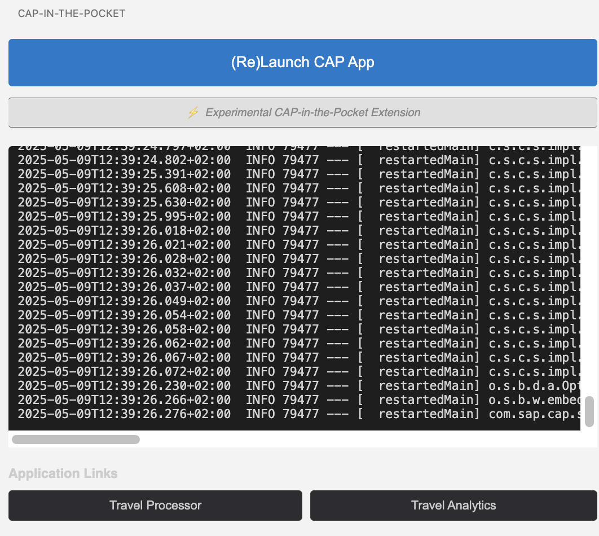

CAP-in-the-Pocket Demo Extension
=============================

This is the corresponding extension for my demo.
It allows you to run

```sh
(lsof -ti:4004 | xargs kill -9) || killall java || true
mvn spring-boot:run
```

with the click of a simple button, show you the output
and allow you to create short-cut links.

**This is highly experimental and used for one single demo.**




## Installation

### Option 1: Latest Release (Recommended)

1. [Download the latest VSIX file](https://github.com/parttimenerd/cap-in-the-pocket-extension/releases/download/snapshot/cap-in-the-pocket-0.0.1.vsix) directly
2. In VS Code:
   - Open Extensions view (Ctrl+Shift+X or Cmd+Shift+X on macOS)
   - Click the "..." at the top of the Extensions view
   - Select "Install from VSIX..."
   - Browse to the downloaded file

Alternatively, visit the [Releases page](https://github.com/parttimenerd/cap-in-the-pocket-extension/releases) to see all available versions.

### Option 2: Build from Source

If you prefer to build the extension yourself:

```bash
git clone https://github.com/parttimenerd/cap-in-the-pocket-extension.git
cd cap-in-the-pocket-extension
npm install
npm run compile
npx @vscode/vsce package
```

Usage
-----
1. After installation, you'll see a new "CAP App" icon in the activity bar
2. Click it to open the "CAP-in-the-Pocket" panel
3. Click the "(Re)Launch CAP App" button to start your application
4. Click the application end-point links

**Notes**

- The port number (4004) is the default for CAP applications but may differ depending on your configuration
- URLs are opened in your default web browser
- Any changes to the configuration take effect immediately

Development
-----------
This has been generated with the help of Claude Sonnet and GitHub Copilot.

Contributing
------------
Contributions are welcome! Please feel free to submit a Pull Request. This is an experimental extension, but if it helps someone.

Icon
----
The icon is the [CAP](https://cap.cloud.sap/) icon. It belongs to CAP. 
The demo is created in collaboration with the CAP Java team, but they have nothing to do with this extension itself.

License
-------
MIT